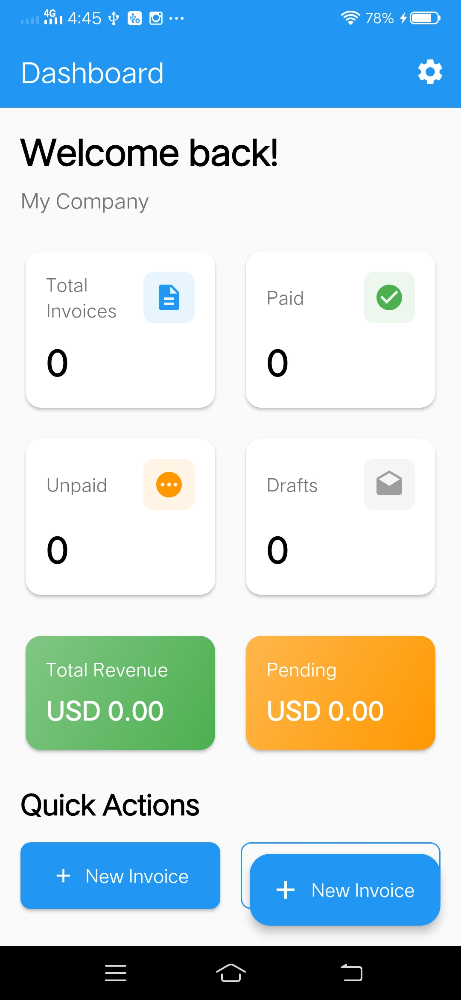
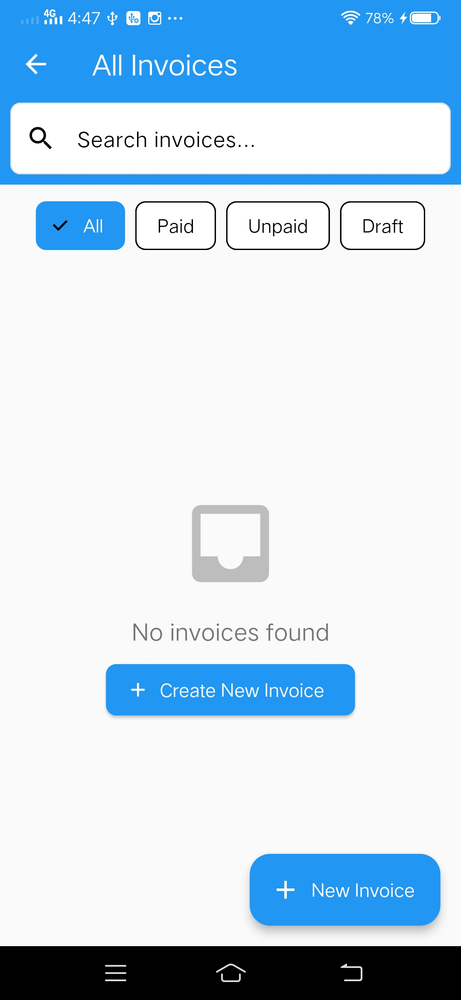
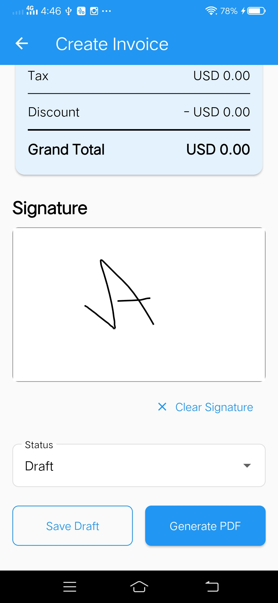
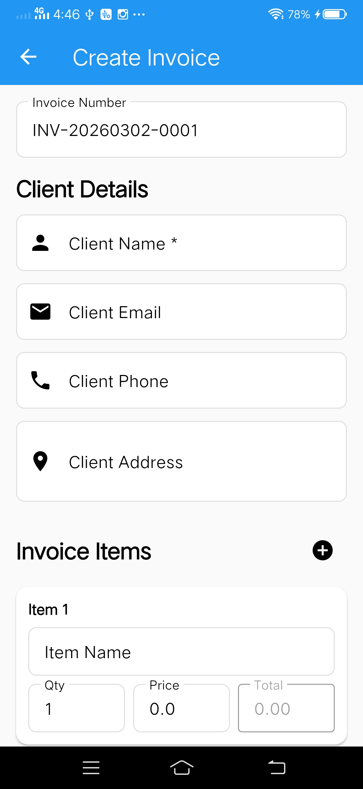
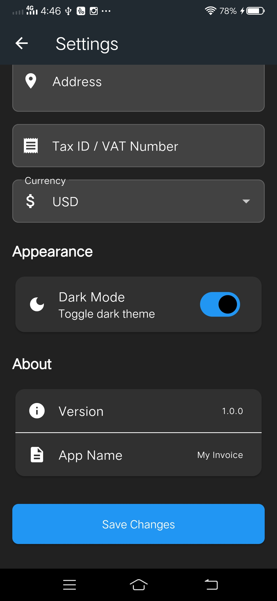
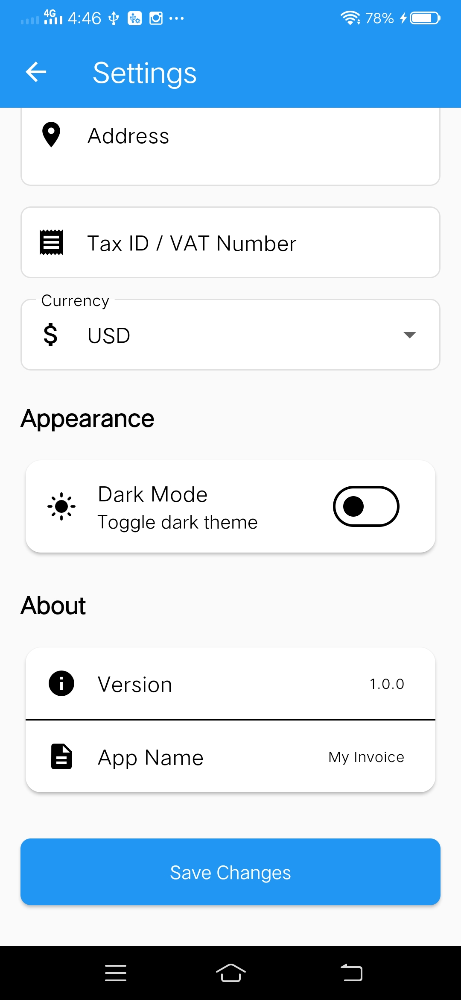
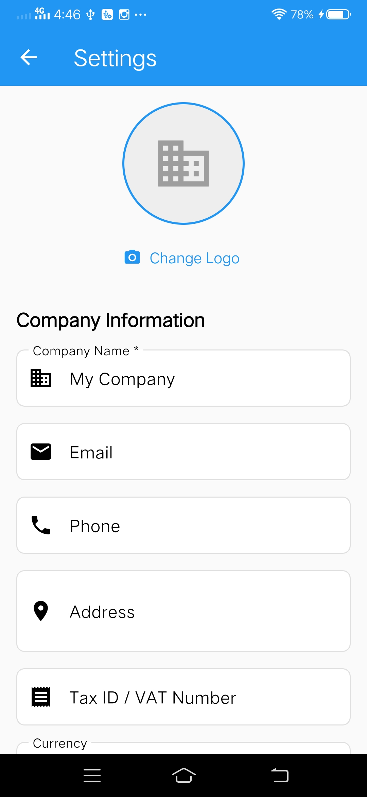

# 🧾 MyInvoice

A production-ready **Invoice Management App** built with Flutter for iOS and Android. Create, manage, and share professional invoices — all stored locally on your device with no internet required.

---

## 📱 App Overview

MyInvoice lets freelancers and small businesses generate beautiful PDF invoices on the go. It handles everything from client details and itemized billing to tax calculations, digital signatures, and PDF sharing via WhatsApp or Email — all powered by a fast local database.

---
## 📸 Screenshots

>   
>   
>   
>   
>   
>   
>   


## ✨ Features

### 📊 Dashboard
- Summary cards: Total, Paid, Unpaid, and Draft invoice counts
- Revenue overview: total earned and pending amount
- Recent invoices list with quick access
- One-tap button to create a new invoice

### 🧾 Create & Edit Invoices
- Client details: name, email, phone, and address
- Multiple line items with quantity, unit price, and auto-calculated subtotals
- Tax percentage and discount (flat amount or percentage)
- Digital signature pad for signing invoices
- Invoice status: **Draft**, **Unpaid**, or **Paid**
- Full form validation

### 📋 Invoice List
- View all invoices in one place
- Filter by status: All, Paid, Unpaid, Draft
- Search by client name or invoice number
- Swipe actions: **Edit**, **Share**, **Delete**

### 📄 PDF Generation & Sharing
- Professionally designed PDF layout
- Includes company logo, client info, itemized table, taxes, discounts, grand total, and digital signature
- Auto-saved to device storage
- Share via WhatsApp, Email, or any app

### ⚙️ Company Settings
- Company name, email, phone, and address
- Upload company logo
- Tax ID / VAT number
- Currency selection (USD, EUR, GBP, INR, AUD, CAD, JPY, CNY)
- Dark / Light theme toggle

---

## 🛠️ Tech Stack

| Technology | Purpose |
|---|---|
| Flutter 3.x | Cross-platform UI framework |
| Dart | Programming language |
| GetX | State management & routing |
| Isar | Fast local database |
| pdf & printing | PDF generation |
| share_plus | File sharing across apps |
| signature | Digital signature capture |
| image_picker | Company logo upload |
| fl_chart | Dashboard charts |
| flutter_slidable | Swipe actions on list items |

---

## 📁 Project Structure

```
lib/
├── controllers/
│   ├── company_controller.dart     # Company settings state
│   └── invoice_controller.dart     # Invoice CRUD & filtering
├── models/
│   ├── company_model.dart
│   ├── invoice_model.dart
│   └── invoice_item_model.dart
├── services/
│   ├── isar_service.dart           # Local database operations
│   └── pdf_service.dart            # PDF generation logic
├── views/
│   ├── screens/
│   │   ├── dashboard_screen.dart
│   │   ├── create_invoice_screen.dart
│   │   ├── invoice_list_screen.dart
│   │   ├── invoice_details_screen.dart
│   │   └── settings_screen.dart
│   └── widgets/
│       └── stat_card.dart
├── routes/
│   └── app_routes.dart
├── utils/
│   └── theme.dart
└── main.dart
```

---

## 🚀 Getting Started

### Prerequisites

- [Flutter SDK](https://docs.flutter.dev/get-started/install) ≥ 3.0.0
- Android Studio (for Android) or Xcode (for iOS)
- A physical device or emulator

### Installation

1. **Clone the repository**

   ```bash
   git clone https://github.com/Abd-ul-Hannan/Myinvoice.git
   cd Myinvoice
   ```

2. **Install dependencies**

   ```bash
   flutter pub get
   ```

3. **Generate Isar database schema**

   ```bash
   flutter pub run build_runner build
   ```

4. **Run the app**

   ```bash
   # Android
   flutter run -d android

   # iOS
   flutter run -d ios
   ```

---

## 📖 How to Use

### First-Time Setup
1. Open the app and tap the ⚙️ **Settings** icon on the Dashboard
2. Enter your company details (name, email, phone, address)
3. Upload your company logo (optional)
4. Set your preferred currency and Tax ID
5. Save — you're ready to invoice!

### Creating an Invoice
1. Tap **"New Invoice"** from the Dashboard
2. Fill in client details (name is required)
3. Add line items: name, quantity, and price
4. Apply tax and/or discount if needed
5. Sign using the digital signature pad
6. Set the status and tap **Save** or **Generate PDF**

### Managing Invoices
- **Filter** invoices by status using the chips (All / Paid / Unpaid / Draft)
- **Search** by client name or invoice number
- **Swipe left** on any invoice to Edit, Share, or Delete

### Sharing a PDF
1. Open an invoice and tap **Generate PDF**
2. The PDF is saved to your device automatically
3. Tap **Share** to send it via WhatsApp, Email, or any app

---

## 🔐 Permissions

### Android
- Storage access — for saving and reading PDFs
- Camera / Gallery — for company logo upload

### iOS
- Photo Library access — for company logo upload
- Files access — for PDF storage

---

## 📋 Requirements

- Flutter SDK: `>=3.0.0 <4.0.0`
- iOS: 11.0 or higher
- Android: API level 21 (Android 5.0) or higher

---

## 📄 License

This project is open source and available under the [MIT License](LICENSE).

---

## 👤 Author

**Abd-ul-Hannan**  
GitHub: [@Abd-ul-Hannan](https://github.com/Abd-ul-Hannan)

---

> Built with ❤️ using Flutter
